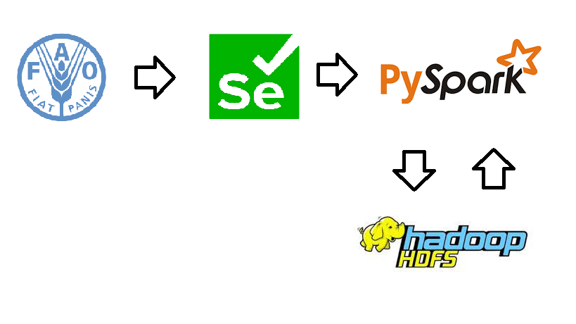

# PROJECT'S TITLE

### Production Crop Livestock

# PROJECT DESCRIPTION

The project is an ETL flow that extract data from **The Food and Agriculture Organization Corporate Statistical Database (FAOSTAT)** [website](https://www.fao.org/faostat/en/#home) about Production of crops and livestock from all regions over the world between 1961 and the latest update, using [PySpark](https://spark.apache.org/docs/latest/api/python/) to transform, store it in **Hadoop Distributed File System**[(HDFS)](https://hadoop.apache.org/docs/r1.2.1/hdfs_design.html) and visualize the data.



# TECHNOLOGY

#### 1. PySpark

* PySpark is the Python API for Apache Spark. It enables you to perform real-time, large-scale data processing in a distributed environment using Python. It also provides a PySpark shell for interactively analyzing your data. 

* PySpark supports all of Spark’s features such as Spark SQL, DataFrames, Structured Streaming, Machine Learning (MLlib) and Spark Core.

The dataset needs to be transformed in the real time transforming process. PySpark supports Machine Learning (MLlib) to perform complex data analysis or machine learning tasks. Therefore, using PySpark is ideal.

#### 2. HDFS

* HDFS is a distributed file system. This means that it can store data across multiple machines, which can make it much faster to access the data than if it were stored on a single machine.
* HDFS is fault-tolerant. This means that if one machine in the cluster fails, the data will still be available on the other machines.
* HDFS is scalable. This means that you can easily add more machines to the cluster as your dataset grows.

This is important because the dataset will grow in the future, so it needs a place that is able to scale the storage capacity

#### 3. Data Modeling

[Fact constellation schema](https://www.geeksforgeeks.org/fact-constellation-in-data-warehouse-modelling/) is a type of data warehouse schema that is a combination of a star schema and a snowflake schema. It is a normalized form of both schemas, meaning that it minimizes data redundancy and improves data integrity.

In a fact constellation schema, there is a central fact table that is surrounded by a number of dimension tables. The dimension tables are normalized, meaning that they are divided into smaller tables that each contain a specific type of data. This helps to improve data integrity and makes it easier to query the data.

The fact constellation schema is a more complex schema than a star schema, but it can be more efficient for certain types of queries. For example, if you need to join data from multiple dimension tables, the fact constellation schema can be more efficient than a star schema.

Advantage: Provides a flexible schema.

Disadvantage: It is much more complex and hence, hard to implement and maintain.

Here is the schema for the project (yellow tables are fact tables and white-colored ones are dimensional tables):


# HOW TO INSTALL (on Windows)

* Install Java 8
* Download Apache Spark in [here](https://spark.apache.org/downloads.html) and install it in local machine. The version of Spark in this project is 3.4.1.
* Set environment variables: Add the Spark installation directory to the system's `PATH` environment variable. Additionally, set the `HADOOP_HOME` and `JAVA_HOME` environment variables to the corresponding paths for your Hadoop and Java installations (if applicable).

Configure Spark: In the Spark installation directory, find the `conf` folder and locate the `spark-env.sh.template` file. Create a copy of this file and rename it to `spark-env.sh`.

Edit the `spark-env.sh` file and add the following line at the end:

SPARK_LOCAL_IP=127.0.0.1
* Install dependencies
```
pip install -r requirements.txt
```
Remember that the release of PySpark and Apache Spark is the same. You can download the release of Apache Spark 3.4 or you can change the release of PySpark to the release of Apache Spark.

* Download Apache Hadoop in [here](https://hadoop.apache.org/releases.html) and install it in local machine. The version of Hadoop in this project is 3.3.6.

The versions of Hadoop and Apache Spark do not conflict.

* Run Hadoop
```
start-all.cmd
```

* Start the Spark cluster

Open a command prompt and navigate to the Spark installation directory. Run the following command to start the Spark master:
```
spark-class org.apache.spark.deploy.master.Master
```

Open others command prompts (each command will open a port as worker node):
```
spark-class org.apache.spark.deploy.worker.Worker spark://127.0.0.1:7077
```
These commands start the Spark master and worker nodes on your local machine.

* Extract

Run all functions in `extract.py` file to get the dataset

* Transform

Run all file with have prefix `transform_` to transform and load data to HDFS as a Data Warehouse.
